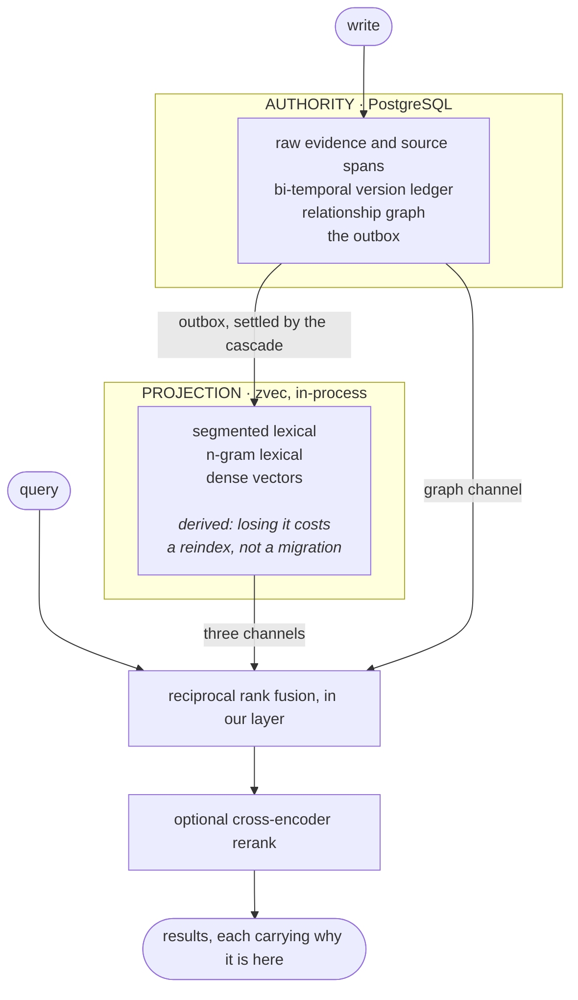

# Architecture

How Påmin Memory is built, and why each piece is the way it is. The one-paragraph
version is in the [README](../README.md#architecture); the decisions behind
this, including the ones that reversed when they were measured, are in
[adr/](adr/).




**A bi-temporal version ledger, not a key-value store.** Every memory carries
both when a fact was true and when the system learned it — application time and
system time, the two period dimensions SQL:2011 names. Superseding a fact
writes a new version and closes the old one's validity rather than overwriting
it, and deletion is a closed interval rather than a `DELETE`. That is what lets
current, stale, contradicted and historical be distinguished instead of
conflated, and it is why a question about what was believed last March has an
answer.

**Evidence is preserved, never rewritten.** Nothing on the write path asks a
language model to decide what a conversation "means". Raw content and its
source spans stay as they arrived; the sensory filter records *why* something
was held back without discarding it. This is an architectural commitment with
measurable consequences, listed under
[benchmarks.md](benchmarks.md): no cost and no external service
on ingest, a store that is byte-identical when the same corpus is written
twice, and answers that survive questions whose evidence was never stated
outright.

**A transactional outbox instead of dual writes.** A write records, in the same
transaction that stores the evidence, what the projection now owes it. A
cascade worker settles that debt afterwards. The index can therefore lag, fail
or be thrown away entirely without the authority ever being wrong — and
`pamin reindex` rebuilds it from PostgreSQL, which is also what keeps the
retrieval engine a replaceable component rather than a permanent commitment.

**Four recall channels, fused above the index rather than inside it.**
Segmented lexical, n-gram lexical, dense vector, and the relationship graph.
The first three come from the projection; the fourth lives in PostgreSQL, where
the index cannot see it. Letting the index pre-fuse its own three would produce
a list that then had to be fused again — weighting its members twice and losing
the rank each held in each channel. Fusing once, above both, is what makes the
result explainable:

```bash
$ pamin search "deployment pipeline" --json | jq '.hits[0].why'
[ { "kind": "channel", "channel": "lexical_ngram", "rank": 1 },
  { "kind": "channel", "channel": "vector",        "rank": 2 },
  { "kind": "channel", "channel": "graph",         "rank": 1 },
  { "kind": "path", "from": "oncall_rota", "via": "oncall_rota", "hops": 1, ... } ]
```

Every hit reports the rank it held in each channel and the graph path that
reached it. There is no step at which a score becomes unattributable.

**A cross-encoder pass, tiered.** Over the fused shortlist, `off`, `fast`
(default) and `accurate` trade latency for quality on a curve that is measured
rather than assumed — the figures are in [cli.md](cli.md), and the one that had
to be corrected twice, along with why, is in
[the ADR](adr/0001-tech-selection.md).

**Everything local.** Embeddings run in-process through ONNX Runtime;
PostgreSQL is bundled rather than something you install. A default install
makes no network call at query time and needs no API key.

### Crate layout

| crate | responsibility |
| --- | --- |
| `pamin-core` | domain model, ledger semantics, fusion. No heavy dependencies, because it is edited most and its rebuild cost sets the development loop. |
| `pamin-store` | the PostgreSQL authority: evidence, ledger, graph, outbox. |
| `pamin-index` | the projection: multilingual segmentation, lexical and vector channels. |
| `pamin-engine` | the only crate that holds both, and therefore the only place they can drift. Sits above `pamin-core` so index types never reach the domain layer. |
| `pamin-cli` | the command surface, and the resident server behind it. |

Design decisions, their trade-offs, and the ones that reversed when measured
are recorded in [adr/](adr/).

